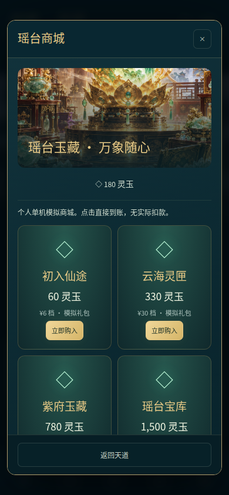
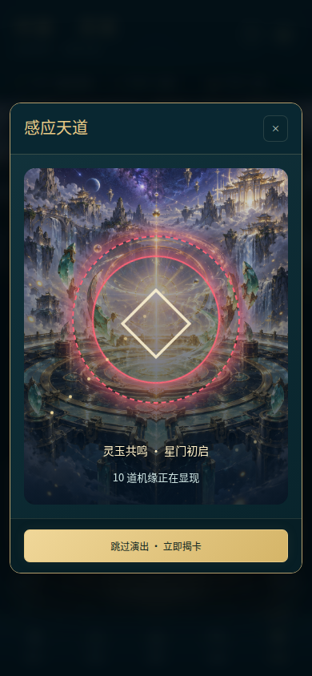
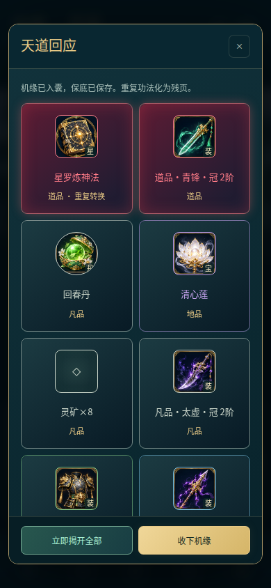

# 问道·灵契 V3 交付

2026-10-06，离线单机Android版本3.0。最低Android8.0。个人发布包沿用旧签名；源码、生成美术、玩法文档与验证脚本均在仓库。

[下载个人发布APK](../releases/wendao-lingqi-v3.apk) · [SHA-256](../releases/wendao-lingqi-v3.apk.sha256) · [完整设计计划](../plan.md) · [玩法说明](GAMEPLAY_V3.md)

## 本次完成

- 炼法/炼体各六境十层，120成长节点；48部功法、六流派、分支、等级里程碑、双路线配置预设。
- 六装备部位，白绿蓝紫橙红六品质，最高红色；强化、打造、重铸、洗炼、觉醒、保护和分解；12灵宝。
- 18丹方，首通收集和稳定研究、炼丹队列、三轮控火、保证基础产量与取消退款；洞府设施和离线生产。
- 自选六类副本、12妖王、60层问道塔、洞天和突破试炼；手动/自动神通、打断、转火、治疗、战术暂停与保存的最近20场战报。
- 六章主线、18支线、宗门委托、三结局、成年同行者关系和三轮灵息共修。
- 五类奖励天道抽取，公开概率、橙红10抽保底、红80抽保底、定向最坏160抽、抽取历史。
- 六档模拟商城，点击购入灵玉直接到账，无实际扣款；60灵玉一次，可兑换感应券或直接感应，与普通券共用保底和奖池。
- 14张原创生成美术：场景、地图、妖王、普通怪、功法、装备/丹药/灵宝、人物和表情、六章场景、商城、祭坛、卡背。
- 抽卡法阵旋转、粒子与红橙光效，逐张翻卡、跳过和立即揭卡；奖励先保存，动画中刷新不重复结算。
- V1/V2存档迁移、导入导出、损坏原文恢复、原生写入失败回滚、后台暂停战斗。

## 验证证据与边界

125/125项Node逻辑测试通过，32/32项真实浏览器检查通过，14张PNG解码成功，没有页面/控制台错误、失败请求、HTTP错误或外部请求。商城与抽卡演出另外定向复核2/2通过。

两路线从全新状态经正式操作零抽卡完成各60层级、12妖王、塔60层、六章和结局，没有注入资源或敌人血量；最高穿戴紫装。模拟时间推进用于验证经济可达性，并非实测多日游玩。

最终APK构建、签名、对齐及24个源文件打包一致性通过，大小48,035,951字节（约45.8MiB）。SHA-256：`7c90a5e6870b8cb1b124af1f5325b75715e0d4fb7b11519a2b64702268343597`。

当前没有Android实体设备，因此尚未验证真机安装、系统文件选择器、WebView生命周期与设备性能。GitHub自动构建使用debug签名，不能直接覆盖个人发布包。

[浏览器记录](BROWSER_VALIDATION.md) · [完整成长记录](PLAYTHROUGH_VALIDATION.md) · [Android记录](ANDROID_VALIDATION.md)

## 画面

